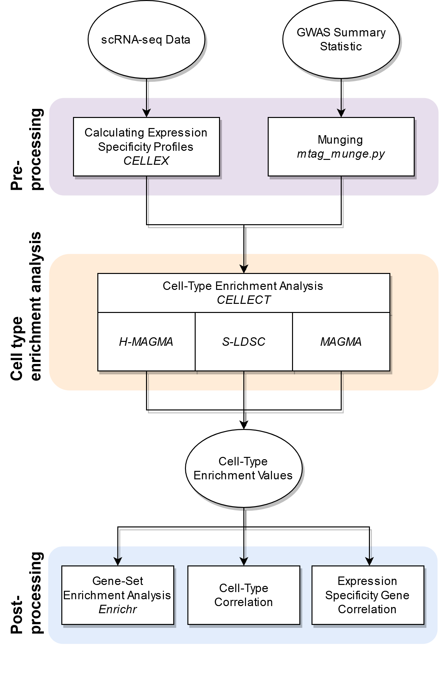

# CELLECT-Revised
Contains additional scripts for [CELLECT](https://github.com/perslab/CELLECT). 
It runs multiple post-processing steps on top of CELLECT output files:
  - GSEA
  - Cell-Type Correlation
  - **WIP**

